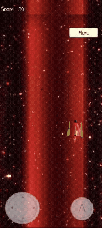
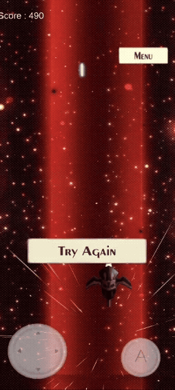

# Amenaza - Mobile Space Shooter (2.5D)

> **Status:** Open Source / Legacy Project (2022)
> **Platform:** Android / Mobile
> **Tech Stack:** Unity 3D, C#, Mobile Input System

Un arcade clásico tipo "Shoot 'em up" (Shmup) desarrollado con assets 3D sobre un plano de juego 2D. El proyecto se centra en la optimización para dispositivos móviles y el diseño de oleadas de enemigos.

### 📱 Gameplay

### 🚀 Aspectos Técnicos (Mobile Optimization)
El reto principal de este proyecto fue mantener un rendimiento estable en móvil con múltiples objetos en pantalla:

* **Object Pooling Pattern:** Implementación de un sistema de reciclaje para proyectiles y asteroides. En lugar de usar `Instantiate/Destroy` (que genera picos de lag por el Garbage Collector), los objetos se desactivan y reutilizan.
* **Mobile Input Handling:**
    * Control táctil optimizado para el movimiento suave de la nave.
    * Adaptación de la UI (User Interface) para diferentes resoluciones de pantalla (Canvas Scaler).
* **Game Loop Logic:**
    * **Wave Manager:** Sistema que gestiona la dificultad progresiva, spawn de asteroides y aparición de enemigos.
    * **Boss FSM:** El Jefe Final cuenta con una máquina de estados simple (Fase de ataque -> Fase vulnerable).
* Todos los Assets son de creación propia.

### 📥 Descargar APK (Android)
Puedes probar el juego en tu dispositivo Android descargando el APK aquí: